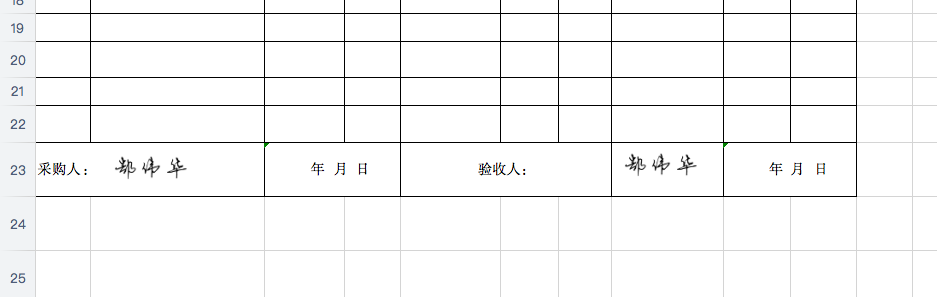

#### 快速操作excel
    
    开发：go run *.go '{"file":"test.xlsx","images":[{"path":"sign.png","height":"70","pos":"B23","y":1,"x":1}],"text":[{"text":"asdfsafd","pos":"A1"}]}'
    生产：./exec '{"file":"test.xlsx","images":[{"path":"sign.png","height":"70","pos":"B23","y":1,"x":1}],"text":[{"text":"asdfsafd","pos":"A1"}]}'

参数说明：

    {
    	"file": "test.xlsx",
    	"images": [{
    		"path": "sign.png",
    		"height": "70",
    		"pos": "B23",
    		"y": 1,
    		"x": 1
    	}],
    	"text": [{
    		"text": "asdfsafd",
    		"pos": "A1"
    	}]
    }
    
##### 效果图：
